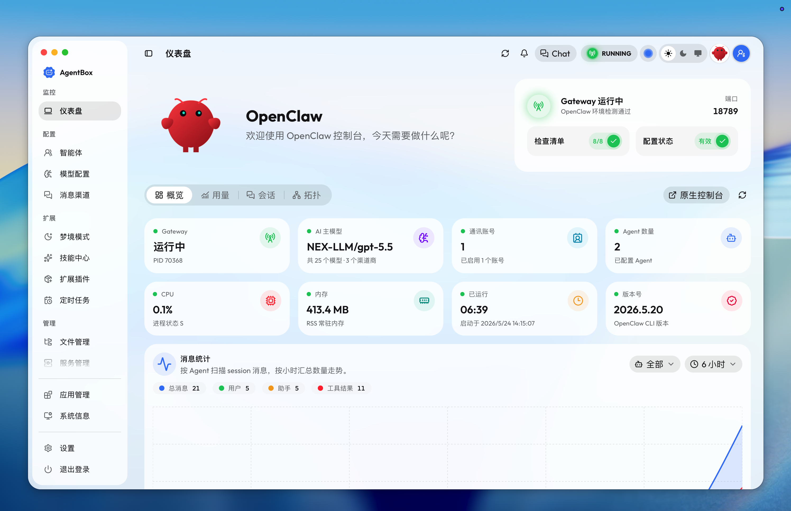

# AgentBox

AgentBox 是一个面向多智能体运行环境的统一管理控制台。它把 OpenClaw、Hermes、CC-Connect 以及相关模型、技能、插件、日志、终端、工作区与部署配置集中到一个 Web/Tauri 应用里，方便开发、调试、部署和日常运维。



本仓库包含：

- React + Vite 前端控制台
- Tauri 桌面客户端工程
- Go 后端 API 服务
- Docker 独立部署配置
- 安装脚本、发布脚本和静态发布数据

## 目录结构

```text
.
├── AgentBox-Docker/          # 已发布镜像的 docker compose 独立部署配置
├── AgentBox-Docker-Build/    # AgentBox Linux 容器镜像构建脚本
├── Anex-Credential/          # anex 登录凭据生成页面
├── Client/                   # React/Vite 前端和 Tauri 桌面端
├── Data/                     # 发布站点和客户端读取的静态 JSON/公告数据
├── Docs/                     # 项目文档预留目录
├── Installation-Script/      # Linux/macOS/Windows 安装脚本
├── Releases-Build/           # 多平台发布构建和 latest.json 生成脚本
└── Server/                   # Go 后端服务
```

`AgentBox-Apple/` 是本地签名、证书和私钥目录，默认被 `.gitignore` 忽略，不应提交到 Git。

## 技术栈

### 前端

- React 19
- Vite 8
- TypeScript
- HeroUI / HeroUI Pro
- React Router
- Zustand
- Tauri 2

### 后端

- Go 1.26
- chi
- Huma OpenAPI
- nhooyr websocket
- modernc SQLite
- slog
- Air 热重载

## 本地开发

### 后端

进入后端目录：

```bash
cd Server
go run github.com/air-verse/air@latest
```

默认监听：

```text
http://127.0.0.1:8787
```

也可以直接运行：

```bash
cd Server
go run ./cmd/agent-box
```

### 前端

进入前端目录：

```bash
cd Client
pnpm install
pnpm dev
```

默认监听：

```text
http://127.0.0.1:5173
```

前端开发端口可通过 `Client/.env` 配置：

```text
FRONTEND_DEV_PORT=5173
```

### Tauri 桌面开发

```bash
cd Client
pnpm tauri:dev
```

Tauri 开发模式会同步本地前端开发地址。

## API 文档

后端启动后可以访问：

```text
http://127.0.0.1:8787/docs
```

常用接口：

- `GET /`：服务信息
- `GET /api/health`：健康检查
- `GET /api/environment`：主机环境检测
- `GET /api/environment?refresh=true`：刷新环境缓存
- `GET /openclaw/environment`：OpenClaw 环境检测
- `GET /openclaw/config`：读取 OpenClaw 配置
- `PUT /openclaw/config`：更新 OpenClaw 配置

OpenAPI 文件：

- `http://127.0.0.1:8787/openapi.json`
- `http://127.0.0.1:8787/openapi.yaml`
- `http://127.0.0.1:8787/openapi-3.0.json`

## 环境变量

后端示例配置见：

```text
Server/.env.example
```

常用变量：

| 变量 | 默认值 | 说明 |
| --- | --- | --- |
| `APP_ENV` | `development` | 运行环境 |
| `SERVER_HOST` | `127.0.0.1` | 后端监听地址 |
| `SERVER_PORT` | `8787` | 后端监听端口 |
| `DATABASE_URL` | `~/.agent-box/data.db` | SQLite 数据库地址 |
| `AUTH_CONFIG_PATH` | `~/.agent-box/auth.json` | 认证配置路径 |
| `AUTH_DEFAULT_TOKEN` | 空 | 首次生成认证配置时使用的默认 token |
| `LOG_LEVEL` | `info` | `debug`、`info`、`warn`、`error` |
| `MODEL_CATALOG_URL` | 官方发布地址 | 模型目录 URL |
| `MODEL_INITIALIZATION_URL` | 官方发布地址 | 模型初始化配置 URL |
| `OPENCLAW_PUBLIC_GATEWAY_URL` | 空 | OpenClaw Gateway 公网地址 |
| `AGENTBOX_PUBLIC_URL` | 空 | AgentBox 公网访问地址 |

Docker 部署变量见：

```text
AgentBox-Docker/.env.example
```

## 静态数据

`Data/` 目录提供客户端和发布站点使用的静态内容：

- `latest.json`：桌面端更新和 Linux 后端下载清单
- `models.json`：模型供应商和模型目录
- `install-packages.json`：安装脚本依赖下载地址
- `notice.md`：客户端公告
- `about.json`、`connect.json`、`promotion.json`：关于页、社群和推荐内容

修改这些文件时注意保持 JSON 格式稳定，避免破坏客户端读取逻辑。

## Docker 部署

使用已发布镜像：

```bash
cd AgentBox-Docker
cp .env.example .env
docker compose up -d
```

默认端口：

| 宿主机端口 | 用途 |
| --- | --- |
| `8787` | AgentBox 控制台 |
| `18789` | OpenClaw Gateway |
| `8080` | WebDAV |

构建容器镜像：

```bash
cd AgentBox-Docker-Build
./build-image.sh
```

更多说明见：

- `AgentBox-Docker/README.md`
- `AgentBox-Docker-Build/README.md`

## 发布构建

发布相关脚本集中在：

```text
Releases-Build/
```

常用入口：

- `Releases-Build/scripts/build.sh`
- `Releases-Build/scripts/build-linux-backend.sh`
- `Releases-Build/scripts/generate-latest-json.mjs`
- `Releases-Build/Update/upload-latest-json.mjs`

发布构建会涉及 Tauri 签名、Apple 证书、updater key、Docker Windows 构建等本地敏感配置。相关私钥和证书应只保存在 `AgentBox-Apple/`，不要提交。

## 安全边界

以下内容默认不应进入 Git：

- `AgentBox-Apple/`
- `*.p8`
- `*.p12`
- `*.key`
- `*.pem`
- `*.cer`
- `*.certSigningRequest`
- `RepositorySecrets.txt`
- `tauri-updater.password`
- `.env`
- `Client/.env`
- `Releases-Build/Update/.env`
- `Client/src-tauri/binaries/*`
- `Client/src-tauri/target/`
- `Server/tmp/`
- `Server/bin/`
- `dist/`、`output/`、`out/`

提交前建议检查：

```bash
git status --short --ignored
git diff --cached --name-only
```

如果需要检查敏感内容：

```bash
git grep --cached -n -I -E 'BEGIN (RSA|OPENSSH|PRIVATE)|github_pat_|ghp_|sk-[A-Za-z0-9_-]{20,}|OPENAI_API_KEY=.+|PASSWORD=.+|SECRET=.+|TOKEN=.+'
```

## 开发约定

- 后端开发默认使用 `go run github.com/air-verse/air@latest`。
- 前端开发默认使用 `pnpm dev`。
- 日常开发不需要执行前端 build。
- 后端业务逻辑或 handler 文件建议在文件开头用中文注释说明职责、接口用途、关键查询参数或缓存策略。
- 优先保持目录边界清晰：前端 API 调用放在 `Client/src/api/`，页面放在 `Client/src/pages/`，后端 handler 放在 `Server/internal/httpapi/handlers/`。
- 生成物、证书、密钥、真实环境变量和本地缓存不要提交。

## 常用命令

```bash
# 后端热重载
cd Server
go run github.com/air-verse/air@latest

# 后端测试
cd Server
go test ./...

# 前端开发
cd Client
pnpm dev

# 前端 lint
cd Client
pnpm lint

# Tauri 开发
cd Client
pnpm tauri:dev

# Docker 独立部署
cd AgentBox-Docker
docker compose up -d
```

## 相关文档

- `Server/README.md`
- `AgentBox-Docker/README.md`
- `AgentBox-Docker-Build/README.md`
- `Installation-Script/README.md`
- `Releases-Build/build.md`
